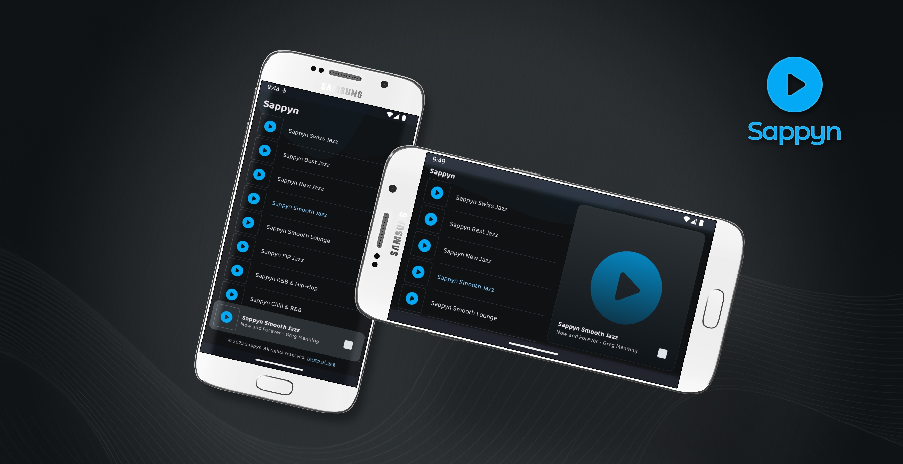

# Sappyn

Sappyn is a robust Android media playback application built with modern Android development practices, offering a seamless and intuitive user experience for consuming both live and on-demand media content. It leverages **Media3** for advanced media capabilities.

## Features

* **Versatile Media Playback:** Enjoy both live streams and on-demand content with a powerful ExoPlayer-based media service, powered by the Media3 library.
* **Intelligent Playlist Management:** Navigate media effortlessly with features like looping and automatic next/previous track selection.
* **Persistent Playback State:** The listening experience is preserved. The app remembers the last played media item and its position, even after closing.
* **Dynamic Artwork Loading:** Beautifully displays album art and media-specific images, enhancing the visual experience.
* **Integration with External Services:** Loading media lists from a REST API.
* **Foreground Service for Uninterrupted Playback:** Media plays smoothly in the background, even when the app is not actively in use.
* **Efficient Resource Management:** Optimized to handle power-saving modes and external media button events for a fluid experience.
* **Deep Link Support:** Facilitates launching the app and playing specific media using custom `sappyn://` URIs.

## Get the App

Experience Sappyn. Download it directly from the Google Play Store:

## License

This project is licensed under the [Apache License 2.0](LICENSE).